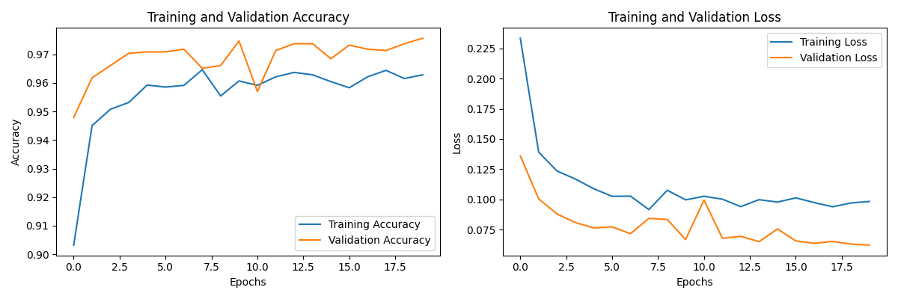
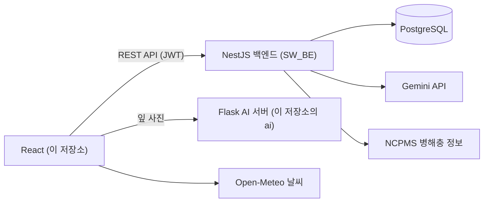

# 🌱 Farmunity

**농사 초보부터 전문가까지, 모두가 함께하는 스마트한 농사 커뮤니티**

농사일지, 작물 일정 관리, 커뮤니티, 체험 예약, 병해충 진단을 한곳에 모은 농업 커뮤니티 웹 서비스입니다.

> 🏅 명지대학교 창의적 SW프로그램 경진대회 수상 (2025년 2학기)

이 저장소는 **프론트엔드와 AI 예측 서버**입니다. 백엔드 API는 [SW_BE](https://github.com/MiMiMinGyu/SW_BE) 저장소에 있습니다.

## 주요 기능

| 기능 | 설명 |
| --- | --- |
| 홈 | 서비스 소개와 주요 기능 바로가기 |
| 마이페이지 | 위치 기반 24시간 날씨, 내 작물 관리, 작물 캘린더, 프로필 설정 |
| 농사일지 | 작물별로 날짜마다 일정과 일지를 사진과 함께 기록 |
| 커뮤니티 | 게시글, 댓글, 좋아요, 인기 태그 |
| 체험 예약 | 전문가가 농사 체험 글을 올리면 취미 사용자가 예약을 신청하고, 전문가가 승인 |
| 병해충 진단 | 잎 사진을 올리면 AI가 작물과 질병 여부를 판별. 증상을 글로 설명하면 가능성 있는 병과 대처법을 안내 |

사용자는 가입할 때 취미 농부와 전문가 중 하나를 선택합니다.

## 병해 진단 AI

작물 잎 사진을 분류하는 이미지 모델을 학습시키고, Flask 서버로 서비스합니다.

| 항목 | 내용 |
| --- | --- |
| 분류 대상 | 고추, 오이, 호박, 토마토 각각의 정상 / 질병 (8개 클래스) |
| 입력 | 224 × 224 RGB 이미지 |
| 프레임워크 | TensorFlow / Keras |
| 학습 | 20 에폭, 검증 정확도 약 97% |
| 서빙 | Flask `POST /predict` — 이미지를 받아 작물, 상태, 신뢰도, 관리 팁을 반환 |



## 시스템 구조



## 기술 스택

| 구분 | 기술 |
| --- | --- |
| Frontend | React 19, React Router, Vite, Axios, react-calendar, react-markdown |
| AI 서버 | Python, Flask, TensorFlow / Keras, Pillow, NumPy |
| 외부 API | Open-Meteo (날씨) |

## 프로젝트 구조

```
Dandelion/
├── src/
│   ├── pages/          # 홈, 커뮤니티, 예약, 병해충, 마이페이지, 로그인, 회원가입
│   ├── components/     # 캘린더, 일지, 작물 사이드바, 날씨, 게시글
│   ├── api/            # 백엔드 API 호출
│   ├── services/       # AI 서버 호출
│   └── context/        # 인증 상태
└── ai/
    ├── app.py                  # Flask 예측 서버
    ├── predict.py              # 단일 이미지 예측 스크립트
    ├── best_chili_model.keras  # 학습된 모델
    └── training_history.png    # 학습 곡선
```

## 실행 방법

세 개의 서버를 함께 실행합니다.

**1. 백엔드 (포트 3000)**

[SW_BE](https://github.com/MiMiMinGyu/SW_BE) 저장소의 안내에 따라 실행합니다.

**2. AI 서버 (포트 5000)**

Python 3.11이 필요합니다.

```bash
cd ai
pip install flask flask-cors tensorflow pillow numpy
python app.py
```

**3. 프론트엔드**

```bash
npm install
npm run dev
```

`http://localhost:5173`에서 열립니다.
